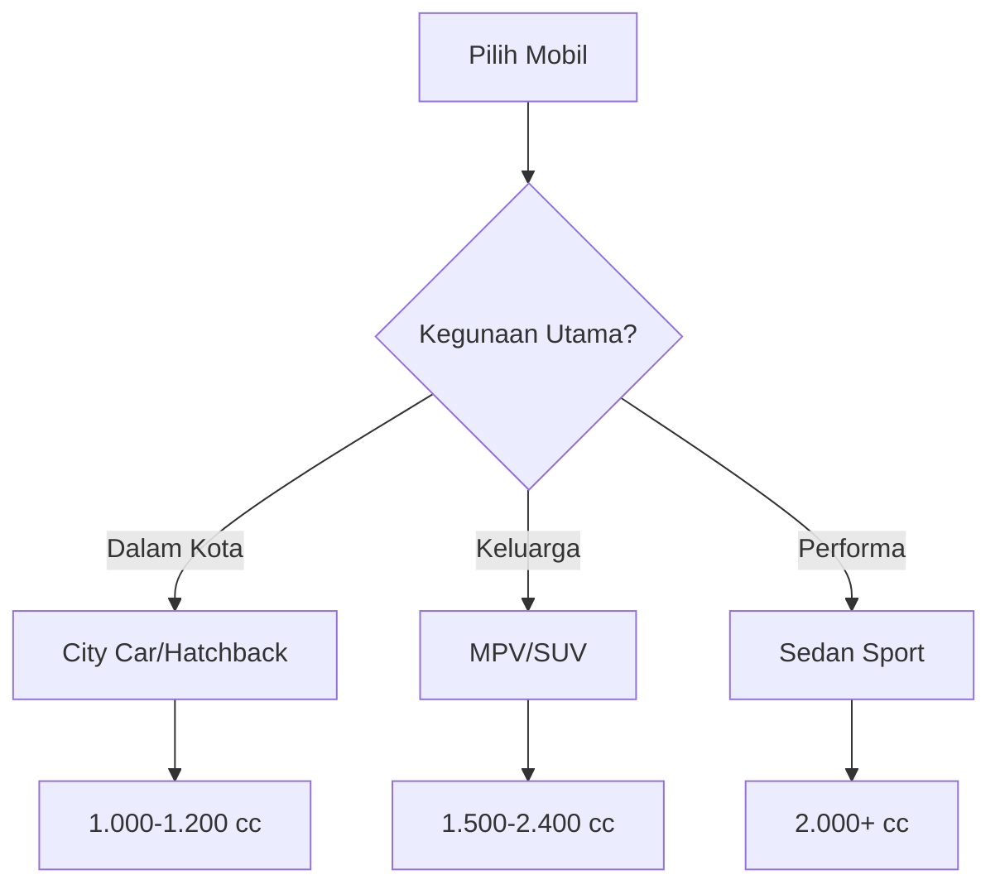

Berikut panduan lengkap untuk memahami spesifikasi mobil yang sering Anda temui di brosur atau website dealer.

# Apa Itu Spesifikasi Mobil?

Spesifikasi mobil adalah detail teknis yang menjelaskan performa, fitur, dan kemampuan kendaraan. Memahami spesifikasi ini penting agar Anda bisa memilih mobil yang sesuai kebutuhan. Sebagian besar informasi ini mencakup angka dan istilah teknis seperti cc (kapasitas mesin), torsi, tenaga, dan fitur keselamatan.

# Panduan Spesifikasi Mobil

Berikut ini penjelasan lengkap tentang berbagai aspek spesifikasi mobil yang perlu Anda ketahui.

## Mesin

### Kapasitas Mesin (cc)

**cc** atau **cubic centimeter** mengukur volume ruang pembakaran dalam silinder mesin. Semakin besar cc, umumnya semakin besar tenaga yang dihasilkan—tetapi juga konsumsi bahan bakar cenderung lebih tinggi.

**Contoh:**
- Mobil city car: 1.000-1.200 cc
- Mobil sedan: 1.500-2.000 cc  
- SUV besar: 2.400-3.000 cc atau lebih

### Tenaga (HP/PS)

Tenaga mesin diukur dalam **horsepower (HP)** atau **pferdestärke (PS)**. Ini menunjukkan seberapa cepat mobil dapat berakselerasi.

**Cara membaca:**
```
Tenaga: 150 HP @ 6.000 rpm
```
Artinya mesin menghasilkan 150 tenaga kuda pada putaran mesin 6.000 rpm.

### Torsi (Nm)

**Torsi** diukur dalam **Newton meter (Nm)** dan menunjukkan kemampuan mesin untuk "menarik" atau akselerasi dari kondisi diam.

**Perbedaan tenaga dan torsi:**
- **Tenaga tinggi** = kecepatan maksimal tinggi
- **Torsi tinggi** = akselerasi kuat, cocok untuk tanjakan dan beban berat

## Transmisi

Ada dua jenis transmisi utama:

### Manual

```
Transmisi: Manual 5-speed
```

- Pengemudi mengoperasikan kopling dan tuas persneling
- Lebih hemat bahan bakar
- Harga lebih murah

### Otomatis

```
Transmisi: CVT (Continuously Variable Transmission)
Transmisi: Automatic 8-speed
```

- Perpindahan gigi otomatis
- Lebih nyaman untuk berkendara di kota
- Harga umumnya lebih mahal

## Konsumsi Bahan Bakar

Biasanya diukur dalam **km/liter** atau **liter/100km**.

**Contoh:**

| Kondisi                  | Konsumsi         |
| ------------------------ | ---------------- |
| Dalam kota              | 12 km/liter      |
| Luar kota               | 16 km/liter      |

Mobil dengan konsumsi bahan bakar efisien akan menghemat biaya operasional dalam jangka panjang.

## Dimensi

Ukuran mobil mempengaruhi kenyamanan dan kemudahan parkir:

```
Panjang x Lebar x Tinggi: 4.500 x 1.800 x 1.700 mm
Wheelbase (jarak sumbu roda): 2.650 mm
Ground clearance (jarak terendah ke tanah): 200 mm
```

- **Wheelbase panjang** = kabin lebih luas
- **Ground clearance tinggi** = cocok untuk medan tidak rata

## Fitur Keselamatan

Fitur keselamatan modern yang perlu Anda perhatikan:

### Passive Safety

- **Airbag** - Kantong udara untuk melindungi penumpang saat tabrakan (minimal 2 airbag, idealnya 6-8 airbag)
- **Seatbelt** - Sabuk pengaman dengan pretensioner
- **Body Structure** - Struktur bodi yang kuat untuk menyerap benturan

### Active Safety

1. **ABS** (Anti-lock Braking System) - Mencegah roda terkunci saat pengereman mendadak
2. **EBD** (Electronic Brakeforce Distribution) - Distribusi rem optimal ke setiap roda
3. **ESC/VSC** (Electronic Stability Control/Vehicle Stability Control) - Menjaga stabilitas mobil
4. **TCS** (Traction Control System) - Mencegah selip saat akselerasi
5. **Hill Start Assist** - Membantu start di tanjakan

### Advanced Driver Assistance Systems (ADAS)

```
- Adaptive Cruise Control (ACC)
- Lane Keep Assist (LKA)  
- Blind Spot Monitoring (BSM)
- Automatic Emergency Braking (AEB)
- 360° Camera
```

Fitur-fitur ini semakin umum di mobil modern dan sangat membantu keselamatan berkendara.

## Kapasitas

**Kapasitas Penumpang:**
```
Kapasitas: 7 penumpang (2-2-3 konfigurasi)
```

**Kapasitas Bagasi:**
```
Volume bagasi: 475 liter
```

Pastikan kapasitas sesuai dengan kebutuhan harian Anda.

## Sistem Penggerak

Ada tiga jenis utama:

| Jenis        | Keterangan                                           |
| ------------ | ---------------------------------------------------- |
| **FWD**      | Front Wheel Drive - Roda depan yang bergerak        |
| **RWD**      | Rear Wheel Drive - Roda belakang yang bergerak      |
| **AWD/4WD**  | All/4 Wheel Drive - Semua roda bergerak (untuk off-road) |

## Grafik Perbandingan

Berikut contoh perbandingan visual antara berbagai tipe mobil:



Diagram ini menunjukkan bagaimana kebutuhan Anda menentukan pilihan tipe dan kapasitas mesin mobil.

---

## Kesimpulan

Memahami spesifikasi mobil membantu Anda:

- Memilih mobil yang sesuai kebutuhan
- Membandingkan berbagai model dengan objektif
- Mendapatkan nilai terbaik untuk investasi Anda
- Menghindari fitur yang tidak perlu dan menghemat budget

Jangan ragu untuk bertanya kepada sales consultant kami untuk penjelasan lebih detail tentang spesifikasi mobil yang Anda minati. Kami siap membantu Anda membuat keputusan terbaik! 🚗
